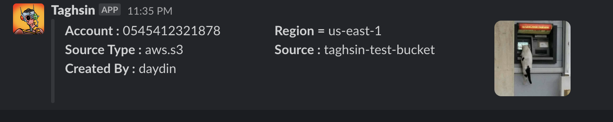

# Taghsin


  <picture>
    <source media="(prefers-color-scheme: dark)" srcset="https://ca.slack-edge.com/TGTSGSX17-UNZDVV1KL-4570f213f05a-512">
    
  </picture>
  
[](https://opensource.org/licenses/Apache-2.0)  
[](https://www.python.org/downloads/release/python-390/)
[](https://aws.amazon.com/serverless/sam/)
[](https://aws.amazon.com/lambda/)
[](https://aws.amazon.com/cloudformation/)

This repository contains code and instructions for auto tagging AWS resources based on predefined rules using CloudTrail events. By setting up this automation, you can ensure that your resources are consistently tagged with useful metadata, making it easier to manage, track, and optimize them.

## Features

* Supports various AWS resource types, including EC2 instances, RDS instances, S3 buckets, and more.
* Configurable tagging rules based on resource properties, such as resource name, resource type, owner, environment, and more.
* Automatic tagging of new resources and updating of existing tags based on changes to the resource properties.
* Built-in support for IAM role-based authentication and authorization for accessing AWS resources.
* Triggers the Taghsin Lambda function using CloudTrail events, allowing for granular and event-driven tagging of resources.

## Installation and Deployment

### Prerequisites
Before you can deploy this application, you will need to have the following prerequisites:

* AWS CLI version 2 or later: https://aws.amazon.com/cli/
* AWS SAM CLI: https://docs.aws.amazon.com/serverless-application-model/latest/developerguide/serverless-sam-cli-install.html
* You will also need to configure your AWS credentials using the aws configure command. If you haven't done this before, see the AWS CLI documentation for instructions: https://docs.aws.amazon.com/cli/latest/userguide/cli-configure-quickstart.html

## Deployment Steps
1. Clone the repository :

  ```bash
  git clone https://github.com/devranaydin/taghsin.git
  ```

2. Navigate into the project directory:

  ```bash
  cd taghsin
  ```


3. Configurations

      The following configurations are required for the project to run properly:

      - Create and publish the Boto3 layer
        ```bash
          cd /tmp

          mkdir layer

          pip3 install -r requirements.txt  -t layer/python/lib/python3.9/site-packages/

          cd layer

          zip -r9 /tmp/boto3_layer.zip *
          
          aws lambda publish-layer-version \
            --layer-name taghsin-layer \
            --description "Boto3 layer for Python" \
            --license-info "MIT" \
            --zip-file fileb:///tmp/boto3_layer.zip \
            --compatible-runtimes python3.9 \
            --region "$region" \
            --profile "$profile"
          ```
      - Update `template.yaml` line 16 example LayerVersionArn with new created LayerVersionArn     
               `arn:aws:lambda:us-east-1:xxx:layer:taghsin-layer:1`

      - By default, notifications are sent to Slack. If you want to use Microsoft Teams instead, you must disable Slack (`ENABLE_SLACK`) and enable the Teams option..
        - ENABLE_SLACK: True 
        - SLACK_CHANNEL: The Slack channel that the notifications will be sent to.
        - SLACK_WEBHOOK_URL: The Slack webhook URL that will be used to send the notifications.
        ```bash
            aws ssm put-parameter --name "/taghsin/slack_channel" --type "String" --value "<value>"
            aws ssm put-parameter --name "/taghsin/slack_webhook_url" --type "String" --value "<value>"
          ```

      
      - The second option is to send notifications to Microsoft Teams. By default, the `ENABLE_TEAMS` value is `False`. If you want to use Microsoft Teams instead, you can update this value inside the `template.yaml` file.
        - ENABLE_TEAMS: True  
        - TEAMS_CHANNEL: The Teams channel that the notifications will be sent to.
        - TEAMS_WEBHOOK_URL: The Teams webhook URL that will be used to send the notifications.  

          ```bash
            aws ssm put-parameter --name "/taghsin/teams_channel" --type "String" --value "<value>"
            aws ssm put-parameter --name "/taghsin/teams_webhook_url" --type "String" --value "<value>"
          ```
      - To exclude certain users from being tagged, you can update the IGNORED_USERS variable. This variable is a list of usernames separated by commas.

          ```bash
             aws ssm put-parameter --name "/taghsin/ignored_users" --type "String" --value "terraform,packer"
          ``` 


4. Deploy the application using deploy.sh:
  


  -  Deploy Lambda 
    ```bash
    deploy.sh --region us-east-1 --profile taghsin --stackName taghsin --bucketName tagsin-development
    ```
  - `region`: The AWS region to use for deployment (default: us-east-1).
  - `profile`: The AWS profile to use for deployment (optional).
  - `stack_name`: The name of the CloudFormation stack to create or update.
  - `bucket_name`: The name of an S3 bucket to use for deployment artifacts 

    This will package the application and deploy it using CloudFormation. If the --bucketName parameter is not specified, a unique bucket name will be generated.

    The script will display the progress of the deployment, including any error messages that may occur.

    Once the deployment is complete, you can verify that the application is running by visiting the AWS CloudFormation console and checking the status of the stack.
  
> **Note**
> Some resources are not region-based, so if you are using a region other than us-east-1, you must deploy this code to that region.
  
5. The deploy.sh script will perform the following steps:

  * Package the SAM application
  * Deploy the packaged application to AWS
  * Create/update the necessary AWS resources (e.g. * AWS Lambda functions, API Gateway endpoints, etc.)

6. The script will output the deployed application's URL.

# Contributing
  If you'd like to contribute to this project, please submit a pull request with your changes. We welcome all contributions, including bug fixes, feature requests, and improvements to the documentation.

  


This project was created by [@devranaydin](https://github.com/devranaydin) and [@gurkanbikli](https://github.com/gurkanbikli)